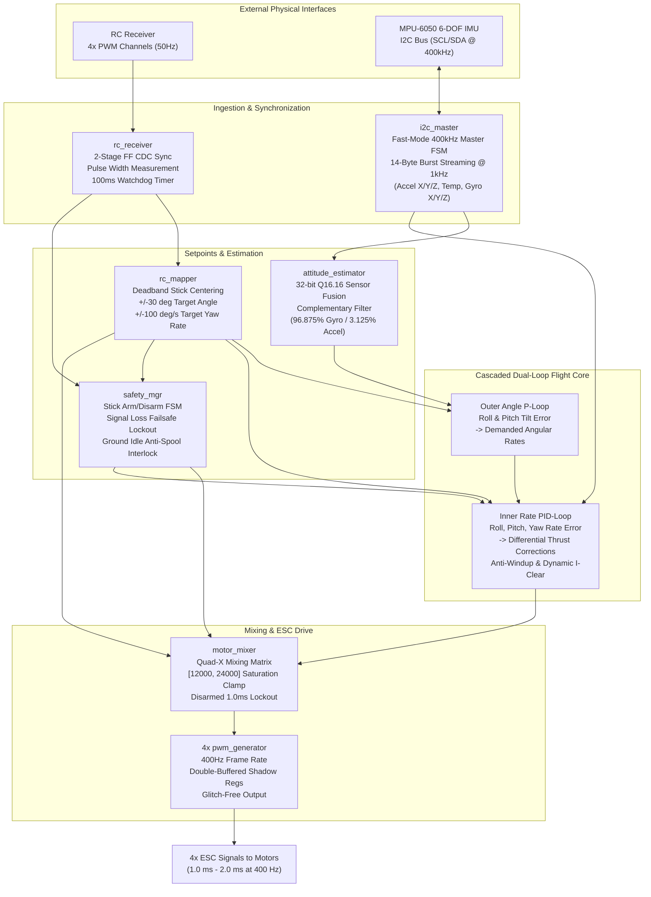

# FPGA Quadcopter Flight Controller (SystemVerilog / Xilinx Artix-7)


An industrial-grade, fully synthesizable **Autonomous Quadcopter Flight Controller** designed from the ground up in SystemVerilog for the **Digilent CMOD A7-35T** development board (Xilinx Artix-7 XC7A35T FPGA).

The system integrates high-speed **6-DOF sensor fusion**, a **cascaded dual-loop PID control framework (Angle / Self-Leveling Mode)**, **metastability-hardened RC pulse decoding**, **glitch-free double-buffered PWM motor drivers**, and an autonomous **safety and arming state machine**.

---

## ?? Table of Contents
1. [Architecture Overview](#-architecture-overview)
2. [Control Theory & Mathematics](#-control-theory--mathematics)
3. [RTL Module Deep Dive](#-rtl-module-deep-dive)
4. [Hardware Platform & Pin Mapping](#-hardware-platform--pin-mapping)
5. [Verification & Simulation Suite](#-verification--simulation-suite)
6. [How to Run Simulations](#-how-to-run-simulations)
7. [Repository File Structure](#-repository-file-structure)

---

## ?? Architecture Overview



---

## ?? Control Theory & Mathematics

### 1. 6-DOF Attitude Estimation (Complementary Filter)
The MPU-6050 provides accelerometer data (noisy in high-frequency flight vibrations, but zero-drift in long-term gravity orientation) and gyroscope angular rates (very clean high-frequency data, but prone to integration drift over time).

The `attitude_estimator` fuses these signals in **32-bit Q16.16 fixed-point arithmetic**:
* **Accelerometer Tilt**:
  $$\theta_{\text{accel}} = \text{accel\_y} \cdot \left(\frac{180}{\pi \cdot 16384}\right) \approx (\text{accel\_y} \cdot 58671) \gg 8 \quad [\text{Q16.16}]$$
* **Gyroscope Integration**:
  $$\Delta \theta_{\text{gyro}} = \frac{\text{gyro\_rate}}{131 \cdot 1000\text{ Hz}} \approx (\text{gyro\_rate} \cdot 32786) \gg 16 \quad [\text{Q16.16}]$$
* **Complementary Filter Blend**:
  $$\theta_{t} = \left(\theta_{t-1} + \Delta \theta_{\text{gyro}}\right) + \frac{1}{32} \left(\theta_{\text{accel}} - (\theta_{t-1} + \Delta \theta_{\text{gyro}})\right)$$
* **Output Conversion**: Truncated to standard **Q8.8 format** (`roll_angle`, `pitch_angle`).

### 2. Cascaded Dual-Loop PID Control
* **Outer Loop (Angle P-Controller)**: Compares the pilot's requested tilt angle (from stick position, $0^\circ$ at center) against the estimated attitude angle:
  $$\text{Desired Rate} = K_{p,\text{angle}} \cdot (\theta_{\text{target}} - \theta_{\text{actual}})$$
* **Inner Loop (Rate PID-Controller)**: Compares the demanded angular rate against the raw gyroscope rate:
  $$u(t) = K_p \cdot e(t) + K_i \int e(t) dt + K_d \frac{de(t)}{dt}$$
* **Anti-Windup Protection**: Integral accumulator is clamped to 16-bit limits ($\pm 32767$), and zeroed upon landing/idle (`clear_i = 1`) to eliminate on-ground motor spool-up.

### 3. Quad-X Mixing Matrix
Translates collective throttle and 3-axis PID corrections into discrete motor commands:
$$\begin{bmatrix} M_1 (\text{Front-Right, CCW}) \\ M_2 (\text{Rear-Right, CW}) \\ M_3 (\text{Rear-Left, CCW}) \\ M_4 (\text{Front-Left, CW}) \end{bmatrix} = \begin{bmatrix} 1 & -1 & -1 & +1 \\ 1 & -1 & +1 & -1 \\ 1 & +1 & +1 & +1 \\ 1 & +1 & -1 & -1 \end{bmatrix} \begin{bmatrix} \text{Throttle} \\ \text{Roll Correction} \\ \text{Pitch Correction} \\ \text{Yaw Correction} \end{bmatrix}$$

---

## ?? RTL Module Deep Dive

| Module | Source File | Description |
| :--- | :--- | :--- |
| **Top Flight Core** | [`rtl/flight_core.sv`](rtl/flight_core.sv) | Top-level hardware wrapper integrating the complete flight controller subsystem. Parameterized for fast simulation. |
| **I2C Master** | [`rtl/i2c_master.sv`](rtl/i2c_master.sv) | Synthesizable 400 kHz Fast-Mode I2C master. Streams 14 continuous bytes starting at register `0x3B` (`ACCEL_X/Y/Z`, `TEMP`, `GYRO_X/Y/Z`) at 1 kHz rate. |
| **Attitude Estimator** | [`rtl/attitude_estimator.sv`](rtl/attitude_estimator.sv) | 6-DOF Complementary Filter executing in Q16.16 fixed-point math to compute estimated roll and pitch tilt angles. |
| **RC Setpoint Mapper** | [`rtl/rc_mapper.sv`](rtl/rc_mapper.sv) | Centers neutral stick pulses (18,000 ticks = 1.5 ms) with $\pm 100\text{ tick}$ jitter deadbands into $\pm 30.0^\circ$ target angles and $\pm 100^\circ/\text{s}$ yaw rates. |
| **Safety Manager** | [`rtl/safety_mgr.sv`](rtl/safety_mgr.sv) | Manages arming (Throttle Min + Yaw Right for 1.0s) and disarming. Drives $1.0\text{ ms}$ disarm lockout and anti-spool PID integral zeroing. |
| **PID Calculator** | [`rtl/pid_calculator.sv`](rtl/pid_calculator.sv) | Q8.8 fixed-point PID controller with anti-windup clamping and synchronous `clear_i` integral reset. |
| **Motor Mixer** | [`rtl/motor_mixer.sv`](rtl/motor_mixer.sv) | Quad-X mixing matrix with `armed` interlock and ESC saturation clamping to $[12000, 24000]\text{ ticks}$. |
| **RC Receiver** | [`rtl/rc_receiver.sv`](rtl/rc_receiver.sv) | 4-channel PWM pulse width decoder with 2-stage FF synchronization, out-of-bounds rejection, and 100 ms lost-signal watchdog. |
| **PWM Generator** | [`rtl/pwm_generator.sv`](rtl/pwm_generator.sv) | 400 Hz ESC driver with synchronous double-buffered shadow registers (`duty_cycle_buf`) eliminating mid-pulse glitching. |

---

## ?? Hardware Platform & Pin Mapping

Targeted for the **Digilent CMOD A7-35T** board ([`constraints/cmod_a7_pins.xdc`](constraints/cmod_a7_pins.xdc)):

| Signal Name | Port Type | Direction | CMOD A7 Pin | Header Pin | Description |
| :--- | :--- | :--- | :--- | :--- | :--- |
| `clk` | 12 MHz CMOS | Input | `L17` | On-board | Master 12 MHz Oscillator |
| `rst_n` | Active-Low | Input | `A18` | BTN0 | System Reset Button |
| `i2c_scl` | Open-Drain | Inout | `M3` | PIO1 | I2C Serial Clock (400 kHz) |
| `i2c_sda_io` | Open-Drain | Inout | `L3` | PIO2 | I2C Serial Data |
| `rc_inputs[0]` | LVCMOS33 | Input | `A16` | PIO3 | RC Channel 1: Roll Input |
| `rc_inputs[1]` | LVCMOS33 | Input | `K3` | PIO4 | RC Channel 2: Pitch Input |
| `rc_inputs[2]` | LVCMOS33 | Input | `C15` | PIO5 | RC Channel 3: Yaw Input |
| `rc_inputs[3]` | LVCMOS33 | Input | `H1` | PIO6 | RC Channel 4: Throttle Input |
| `esc_pwm_outputs[0]` | LVCMOS33 | Output | `A15` | PIO7 | Motor 1 (Front Right CCW) |
| `esc_pwm_outputs[1]` | LVCMOS33 | Output | `B15` | PIO8 | Motor 2 (Rear Right CW) |
| `esc_pwm_outputs[2]` | LVCMOS33 | Output | `A14` | PIO9 | Motor 3 (Rear Left CCW) |
| `esc_pwm_outputs[3]` | LVCMOS33 | Output | `J3` | PIO10 | Motor 4 (Front Left CW) |

---

## ?? Verification & Simulation Suite

The test suite provides **100% automated self-checking coverage** across all modules:

| Testbench File | Target Module | Verified Behaviors | Result |
| :--- | :--- | :--- | :--- |
| [`tb/pwm_generator_tb.sv`](tb/pwm_generator_tb.sv) | `pwm_generator` | 400 Hz frame timing, 10% & 50% duty cycles, shadow register mid-pulse protection | **PASSED (0 Errors)** |
| [`tb/motor_mixer_tb.sv`](tb/motor_mixer_tb.sv) | `motor_mixer` | Disarmed lockout (12,000), neutral hover (18,000), upper & lower saturation clamping | **PASSED (0 Errors)** |
| [`tb/pid_calculator_tb.sv`](tb/pid_calculator_tb.sv) | `pid_calculator` | Proportional tracking (+3.0), derivative damping (-1.0), anti-windup clamping, `clear_i` reset | **PASSED (0 Errors)** |
| [`tb/rc_receiver_tb.sv`](tb/rc_receiver_tb.sv) | `rc_receiver` | 2-stage FF CDC synchronization, 1.0?2.0 ms pulse timing, clamping, 100 ms watchdog failsafe | **PASSED (0 Errors)** |
| [`tb/attitude_estimator_tb.sv`](tb/attitude_estimator_tb.sv) | `attitude_estimator` | Flat level (0.0?), static +10.0? Roll convergence, static +15.0? Pitch convergence | **PASSED (0 Errors)** |
| [`tb/i2c_master_tb.sv`](tb/i2c_master_tb.sv) | `i2c_master` | 400 kHz SCL clocking, MPU-6050 power wakeup (`0x6B`), continuous 14-byte burst read | **PASSED (0 Errors)** |
| [`tb/flight_core_tb.sv`](tb/flight_core_tb.sv) | `flight_core` | Full cascaded system: disarm lock, stick arming, closed-loop auto-leveling tilt compensation | **PASSED (0 Errors)** |

---

## ?? How to Run Simulations

Simulations can be compiled and executed directly using the AMD Vivado command-line tools:

### Run Individual Testbenches
```powershell
# 1. Add Vivado binaries to path
$env:PATH = "C:\AMDDesignTools\2025.2.1\Vivado\bin;" + $env:PATH

# 2. Simulate Full Closed-Loop Flight Core
xvlog -sv rtl/pwm_generator.sv rtl/pid_calculator.sv rtl/motor_mixer.sv rtl/rc_receiver.sv rtl/rc_mapper.sv rtl/safety_mgr.sv rtl/attitude_estimator.sv rtl/i2c_master.sv rtl/flight_core.sv tb/flight_core_tb.sv
xelab -debug typical flight_core_tb -s flight_sim
xsim flight_sim -R

# 3. Simulate Attitude Estimator (Complementary Filter)
xvlog -sv rtl/attitude_estimator.sv tb/attitude_estimator_tb.sv
xelab -debug typical attitude_estimator_tb -s att_sim
xsim att_sim -R
```

---

## ?? Repository File Structure

```text
FPGA_Flight_Controller/
??? constraints/
?   ??? cmod_a7_pins.xdc         # Pin placement & timing constraints for Digilent CMOD A7-35T
??? flight_controller_spec.md    # Top-level engineering requirements & design specification
??? README.md                    # Project documentation & architectural deep dive
??? rtl/
?   ??? attitude_estimator.sv    # 6-DOF Complementary Filter (Sensor Fusion)
?   ??? flight_core.sv           # Top-level Cascaded Dual-Loop Flight Controller
?   ??? i2c_master.sv            # 400 kHz Fast-Mode I2C Master (14-Byte Burst Reader)
?   ??? motor_mixer.sv           # Quad-X Mixing Matrix with ESC Bounds Clamping
?   ??? pid_calculator.sv        # Q8.8 Fixed-Point PID Controller with Anti-Windup
?   ??? pwm_generator.sv         # 400 Hz Glitch-Free Double-Buffered PWM Generator
?   ??? rc_mapper.sv             # Stick Centering, Deadband & Setpoint Scaling
?   ??? rc_receiver.sv           # Metastability-Synchronized 4-Channel Pulse Decoder
?   ??? safety_mgr.sv            # Arming/Disarming FSM & Ground-Idle Anti-Spool Interlock
??? tb/
    ??? attitude_estimator_tb.sv # Attitude estimator unit testbench
    ??? error_report.md          # Verification and issue resolution log
    ??? flight_core_tb.sv        # End-to-end full system closed-loop testbench
    ??? i2c_master_tb.sv         # I2C master & MPU-6050 slave model testbench
    ??? motor_mixer_tb.sv        # Motor mixer saturation testbench
    ??? pid_calculator_tb.sv     # PID calculator mathematical unit testbench
    ??? pwm_generator_tb.sv      # PWM double-buffering timing testbench
    ??? rc_receiver_tb.sv        # RC receiver decoder & watchdog testbench
```
